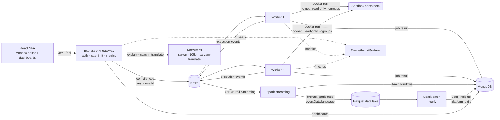

# CloudExec: Personalised Cloud Coding Platform for Indian Learners

> **Big Data & Cloud Engineering project.** Kafka · Docker sandboxes · Spark Structured Streaming · Parquet data lake · MongoDB · Kubernetes · Prometheus · **Sarvam AI**

CloudExec is an online code runner (C, C++, Java, Python and JavaScript) that **learns from every program a student runs**.
Each run becomes an event in a streaming pipeline. Spark turns those events into a personal skill profile for each user: skill score, percentile, weak areas, streaks and weekly trend.
**Sarvam AI** then explains errors and writes a weekly study plan **in the student's own language**: Hindi, Tamil, Telugu, Kannada, Bengali, Marathi, Gujarati, Malayalam, Punjabi, Odia or English.

### Why it matters (impact)

Most Indian students learn programming in English, which is often not their first language. Compiler errors are terse and English-only. CloudExec addresses this in two ways:

1. **Removes the language barrier.** Errors are explained in 11 Indian languages by an Indic-first LLM (Sarvam-105B), with code and keywords kept in English.
2. **Gives every learner a personal mentor.** Feedback is grounded in the learner's own data, for example: *"You've hit `IndexError` 14 times this month. That's 38% of your errors. Practise array bounds."* It is not generic advice.
3. **Gives colleges and instructors platform analytics.** They can see which mistakes are most common, which students are struggling (percentile and trend), and when students code.

---

## Architecture



| Layer | What it does | Big data / cloud concept |
|---|---|---|
| **API gateway** (`server/app.js`) | JWT auth, per-user rate limits, input limits, `/healthz` `/readyz` `/metrics` | Stateless and horizontally scalable (HPA) |
| **Job queue** (`compile-jobs`) | Jobs keyed by `userId`, with 6+ partitions | Partitioning, per-user ordering, fair scheduling, consumer groups |
| **Workers** (`server/worker.js`) | Consume jobs, run them in Docker, write results, emit analytics events | Elastic scale-out; job state in MongoDB, not memory |
| **Sandbox** (`server/executor.js`) | `--network=none --read-only --cap-drop=ALL --pids-limit --memory --cpus`, non-root user, tmpfs, wall-clock kill | Multi-tenant isolation; no host bind mounts, so it runs on DinD or a remote Docker host |
| **Streaming** (`spark/streaming_ingest.py`) | Kafka → Parquet bronze lake (exactly-once via checkpoints), plus 1-minute watermarked windows → `live_metrics` | Structured Streaming, watermarks, partitioned data lake |
| **Batch** (`spark/batch_insights.py`) | Per-user skill model and platform aggregates → MongoDB (parallel idempotent upserts) | Window functions, gaps-and-islands, percentile ranks, medallion architecture |
| **AI** (`server/aiRoute.js`, `server/sarvam.js`) | Error explanations, personalised coaching, translation | LLM grounded in each user's own analytics (RAG over their data) |
| **Ops** | docker-compose, K8s manifests (HPA, CronJob, DinD workers, optional KEDA on Kafka lag), Prometheus, Grafana, Kafka UI, GitHub Actions → GHCR | Cloud-native deployment and observability |

---

## What each user sees: personalised data

**My Dashboard** combines real-time MongoDB aggregations with Spark-computed insights:

| Metric | Source |
|---|---|
| Runs, success rate, p50/p90 runtime, lines written, active days | MongoDB `$facet` (real time) |
| Current and longest streak, peak coding hour, 120-day activity heatmap | MongoDB (real time) |
| Language mix, top recurring errors (`IndexError · Python ×14`), error categories | MongoDB (real time) |
| **Skill score (0–100)**, **level**, **percentile vs all learners** | Spark batch |
| **Proficiency per language**: success rate, volume, runtime efficiency vs peers, recent form | Spark batch |
| **Focus areas**: top error types mapped to learning topics, with share % | Spark batch |
| **Weekly trend** (improving / steady / declining) and **rule-based recommendations** | Spark batch |
| **AI study plan**: strengths, focus areas, 7-day plan, in the learner's language | Sarvam AI, using all of the above |

**Platform** (admins listed in `ADMIN_EMAILS`) shows users, DAU/WAU, error rate, p95 runtime, Kafka queue wait, live runs per minute (from streaming), daily volume (from batch), language mix, most common errors across the platform with number of learners affected, load per worker, and a skill leaderboard.

Skill score per language = `0.45·success + 0.20·volume(log) + 0.20·efficiency(percentile of p50 runtime among peers) + 0.15·last-14-day success`. The overall score is weighted by runs. See `spark/insights_lib.py`.

---

## Sarvam AI integration

| Feature | Endpoint | Sarvam API |
|---|---|---|
| Explain error / output, auto-triggered on failure | `POST /api/ai/explain` | `POST https://api.sarvam.ai/v1/chat/completions`, model `sarvam-105b`, `response_format: json_object` |
| Personal coach / weekly plan (cached 6 h) | `POST /api/ai/coach` | same; prompt includes the user's dashboard and Spark insights |
| Translate any text | `POST /api/ai/translate` | `POST https://api.sarvam.ai/translate`, model `sarvam-translate:v1` (chunked to 2,000 chars) |

Auth uses the `api-subscription-key` header. Every AI call is logged to `ai_interactions` (feature, language, model, token usage), so you can track credit spend per user. AI calls are rate-limited per user (`RATE_LIMIT_AI_PER_MIN`).
Set `SARVAM_API_KEY` to enable these features. Without a key, the rest of the platform still works and the UI shows **AI off**.

---

## Quick start: full stack with Docker

```bash
cp .env.example .env          # set SARVAM_API_KEY, JWT_SECRET, ADMIN_EMAILS
docker compose up -d --build  # kafka, mongodb, api, 2 workers, web, spark-streaming, spark-batch
open http://localhost:3000
```

* Register with an e-mail listed in `ADMIN_EMAILS` to get the **Platform** tab.
* Scale workers: `docker compose up -d --scale worker=4`
* Observability: `docker compose --profile observability up -d` starts Prometheus (:9090), Grafana (:3001) and Kafka UI (:8080).

### Generate big-data volume

```bash
make seed        # 200 users, 50k events into MongoDB
make seed-big    # 2,000 users, 1M events, also streamed through Kafka → Spark → lake
```

Synthetic users have personas: skill level, favourite languages, active hours and recurring mistakes. They improve over time, so the batch job finds real trends.
Every synthetic user can sign in as `studentN@demo.cloudexec.dev` / `password123`.

**Measured locally (4 vCPU, Spark `local[*]`):** 1,000,011 events (391 MB JSON) for 2,000 users → full insight model in **48 s**. 200k events read from MongoDB via the Spark connector → 501 user profiles written back in **33 s**. MongoDB ingest from the generator runs at about 40k events/s.

---

## Local development

```bash
make infra                 # Kafka + MongoDB only
make images-pull           # sandbox images
cp .env.example server/.env
cd server && npm install && USE_KAFKA=true npm run dev     # API on :8000
cd server && USE_KAFKA=true npm run worker                  # worker (run several)
cd client && npm install && npm run dev                     # UI on :3000 (proxies /api)
```

No Kafka? Leave `USE_KAFKA=false` and the API runs jobs inline (sync mode).

### Spark jobs

```bash
pip install -r spark/requirements.txt
# straight from MongoDB
spark-submit --packages org.mongodb.spark:mongo-spark-connector_2.12:10.4.0 spark/batch_insights.py --source mongo
# streaming ingest from Kafka into a local lake
spark-submit --packages org.apache.spark:spark-sql-kafka-0-10_2.12:3.5.3 spark/streaming_ingest.py \
  --brokers localhost:9092 --lake ./data/lake/executions --checkpoints ./data/checkpoints
# batch from the lake
spark-submit spark/batch_insights.py --source lake --path ./data/lake/executions
```

---

## Deploy to Kubernetes

See [`k8s/`](k8s/README.md): API Deployment and HPA, worker Deployment with a Docker-in-Docker sidecar and HPA (optional KEDA scaling on Kafka consumer lag), web and Ingress, a Spark streaming Deployment, and an hourly Spark `CronJob`. CI (`.github/workflows/ci.yml`) tests all three components and pushes images to GHCR.
For production, use managed Kafka (MSK / Confluent / Strimzi) and MongoDB Atlas, store the lake in object storage (`s3a://`, `gs://`), and use gVisor or Kata for the sandbox runtime.

---

## API

| Method | Path | Auth | Description |
|---|---|---|---|
| POST | `/api/auth/register`, `/api/auth/login` | – | Returns a JWT |
| GET/PATCH | `/api/auth/me` | user | Profile and preferred language |
| POST | `/api/compile` | user | `{language, code, input}` → `202 {jobId}` (Kafka) or the result (sync) |
| GET | `/api/jobs/:jobId` | user (owner) | Job status and result |
| GET | `/api/me/dashboard?days=90` | user | Personal analytics and Spark insights |
| GET | `/api/me/history` | user | Run history (filter by language/status) |
| POST | `/api/ai/explain`, `/api/ai/coach`, `/api/ai/translate` | user | Sarvam AI features |
| GET | `/api/admin/analytics` | admin | Platform analytics |
| GET | `/healthz`, `/readyz`, `/metrics` | – | Probes and Prometheus metrics |

## Data model (MongoDB)

* `users`: profile, role, preferredLanguage, goal
* `executions`: one document per job: status, runtime, wallTime, queueMs, exitCode, errorCategory, errorType, linesOfCode, workerId, timestamps (plus code and truncated output for the owner)
* `user_insights`: Spark gold table, one document per user
* `platform_daily`: Spark gold table, one document per day
* `live_metrics`: Spark streaming, 1-minute windows (2-day TTL)
* `ai_interactions`: AI usage and token accounting

## Tests

```bash
make test   # server unit tests (node:test), client lint+build, Spark pytest
```

## Project structure

```
server/   API gateway, worker, sandbox executor, error classifier, Sarvam client, seed generator
client/   React + Vite SPA (editor, personal dashboard, platform analytics, profile)
spark/    insights_lib.py (pure transforms), batch_insights.py, streaming_ingest.py, tests
k8s/      Kubernetes manifests
infra/    Prometheus and Grafana provisioning
```
